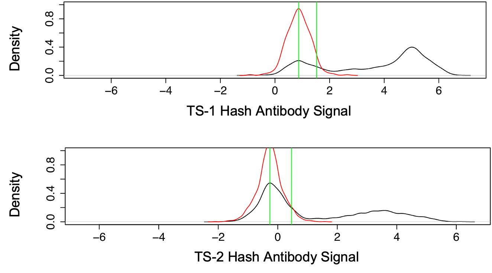
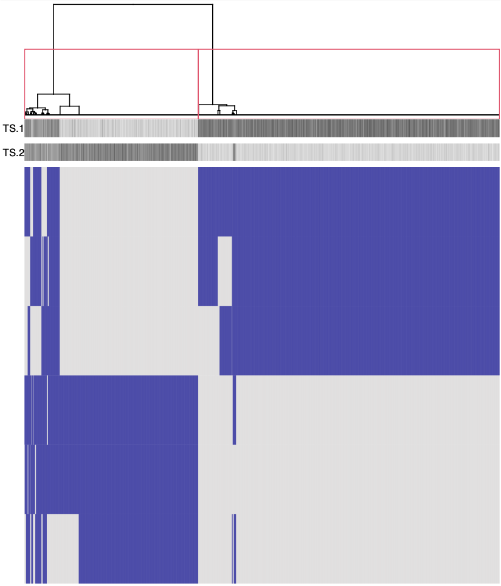
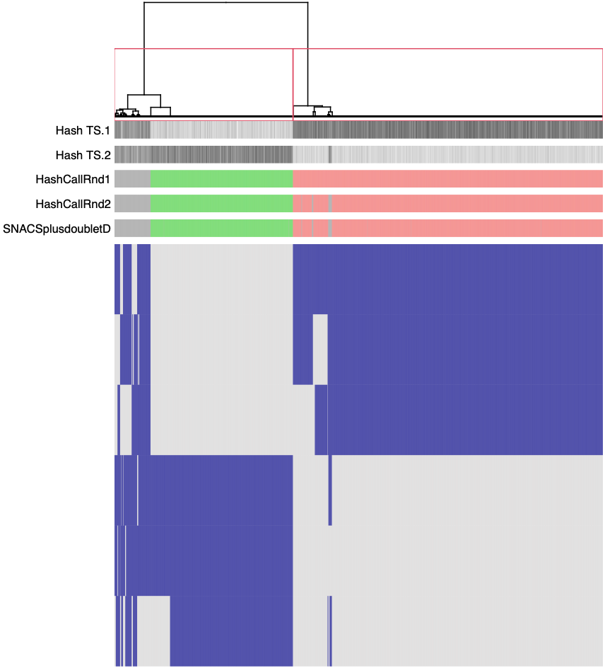

# Overview of SNACS Analysis Workflow

##### This document provides an overview of the various R functions that comprise SNACS.
##### This overview will reproduce this analysis and visualizations from Experiment 5 in the associated SNACS manuscript, in which 2 patients were multiplexed together. 

First we load SNACS and any dependencies. 

```{r}
library(SNACS)
library(heatmap4)
```
SNACS can be initiated directly from the .hdf5 file that outputs from the open-source alignment and cell calling pipline utilized in this manuscript. Alternatively, if FASTQ files from multiplexed SC DNAseq experiments are aligned using a different pipeline (e.g. Mission Bio Tapestri), genotype, hash antibody signal, total depth, and alternate depth matrices will needto be extracted and then inputted into the SNACSList function.  

```{r}
fileName <- "SNACS5.genotypes.hdf5" # This .hdf5 file is deposited in GEO and available for public use. 

h5toList <- h5readForSNACS(file=paste0("../data/",fileName))

```

Next, we create a SNACSlist object. A SNACSlist object is a simple list-based object that SNACS uses to store data. In addition to creating the SNACSlist object, the **SNACSList function** confirms the input data is in the correct format. The SNACSList object outputs the name of the experiment, the total number of SNPs, the total number of cells, and the number of hashes.

```{r}
exptName <- "Experiment5"
hashColors <- c("red", "blue")

snacsObj <- SNACSList(mut=h5toList$mut,hashes=h5toList$hashes[hashNames,],exptName=exptName,hashColors=hashColors,
                          depthTotal=h5toList$depthTotal,depthAlt=h5toList$depthAlt,annCell=h5toList$annCell,annSNP=h5toList$annSNP)
snacsObj

An object of class "SNACSList"
Experiment name: Experiment5
No. of SNPs: 70476
No. of cells: 2651
Hashes: TS.1, TS.2
SNACSList attributes: mut, hashes, exptName, depthTotal, depthAlt, annHash, annCell, annSNP, processLevels
Output files are saved in "../output" folder
```

The SNACSlist object is then filtered using the **filterData function** to remove very low or very high frequency SNPs as these will be less informative for demultiplexing. The default values for this function remove any single cell with <40% of SNPs genotyped, any single SNP with <40% of single cells genotyped, all SNPs mutated in > 95% all single cells, and all SNPs mutated in <5% of all single cells. These parameters are optional arguments in the filterData function and can be adjusted. In the example below, the total number of SNPs decreased to 77, reflecting that many SNPs were unmutated (i.e., 0) in all single cells. The number of single cells remained the same, at 2651.

```{r}
snacsObj <- filterData(snacsObj=snacsObj)

An object of class "SNACSList"
Experiment name: snacsExpt
No. of SNPs: 77
No. of cells: 2651
Hashes: TS.1, TS.2
SNACSList attributes: mut, hashes, exptName, depthTotal, depthAlt, annHash, annCell, annSNP, processLevels
Output files are saved in "../output" folder
```
The **getBestSNPs function** groups single cells into preliminary groups bashed in hash antibody data, and selects the best SNPs that separate the single cells into these groups. In Experiment 5, this step identified 6 distinguishing SNPs, which are stored in the annSNP dataframe in the SNACslist object.

```{r}
snacsObj <- getBestSNPs(snacsObj,hashThreshold=0.5,outputFormat="pdf")
```

The **generateAntibodyDensityPlot function** generates plots of the hash antibody distrubtion. The actual antibody expression is plotted in black. To generate the expected bimodal hash antibody distribution, we fit a Gaussian distribution to the left-most actual distribution (red line) and reflect the data to the left of the mode about the mode. 


```{r}
generateAntibodyDensityPlot(snacsObj)
```


The **imputeMissingMutations function** imputes missing data prior to hierarchical clustering. 

```{r}
snacsObj <- imputeMissingMutations(snacsObj=snacsObj)
```

The **clusterCellsWithSNPdata function** performs hierarchical clustering where the number of cells is the number of constituent samples using the imputated mutation data from the SNPs selected by the getBestSNPs function. The function also generates an initial heatmap showing the results of this clustering with the hash antibody distributions, providing a simple visualization of the clustering result. In the image below, the 6 SNPS chosen by the getBestSNPs function are rows, and single cells are columns where dark blue indicates mutated cells (i.e., "1") and grey indicates unmutated (i.e., "0"). The distribution of the hash antibody signal are added as rows at the top of the heatmap. 

```{r}
outputFileName <- "Experiment5"
snacsObj <- clusterCellsWithSNPdata(snacsObj)
```



The **makeSnacsCall function** assigns single cells to a single sample or multiplet. This is done in 2 stages, or rounds. First, the cell cluster obtained from running clusterCellsWith SNPdata are split into sub-clusters. Clusters are split if a significant difference is found when comparing hash antibody signals of the the daughter nodes, and the process is stopped when no additional differences are found. A new column, "hashCallRnd1" is added to the annCell dataframe in the snacsObj with these results. Second, multiple detection is refined using circular binary segmentation. A new column, "hashCallRnd2" is added to the annCell dataframe in the snacsObj with these results.

The makeSnacsCall function also outputs a table of the number of cells assigned to each hash antibody. In Experiment 5 below, TS.1 is Sample 1, TS.2 is Sample 2, and TS.1_TS.2 is are multiples. A final new column, "hashCall", is also added to the annCell dataframe in the snacsObj, which includes the final hash call for each single cell. 

```{r}
snacsObj <- makeSnacsCall(snacsObj)

hash calls     1    2
  TS.1         0 1581
  TS.1_TS.2  187   18
  TS.2       735    0
```

The **runSNACSplusDoubletD function** is an optional step for identifying doublets based on total and alternate allele depth. If this function is run, the column "snacsPlusDoubletDCall" will be added to the annCell dataframe in the snacsObj detailing the combined results of doubletD and SNACS. 

```{r}
snacsObj <- runSNACSplusDoubletD(snacsObj)
```

The **createHeatmap function** provides a final visualization of the SNACS output. In the image below, the 6 SNPS chosen by the getBestSNPs function are rows, and single cells are columns where dark blue indicates mutated cells (i.e., "1") and grey indicates unmutated (i.e., "0"). Rows at the top of the heatmap depict hash antibody signal and the outputs from hashCallRnd1, hashCallRnd2, and snacsPlusDoubletDCall from the makeSnacsCall function and runSNACSplusDoubletD function.

```{r}
createHeatmap(snacsObj,cell_anno_var=c("snacsPlusDoubletDCall","hashCallRnd2","hashCallRnd1", "TS.2", "TS.1"),
              cell_anno_name=c("SNACSplusdoubletD ","HashCallRnd2 ","HashCallRnd1 ","Hash TS.2 ", "Hash TS.1 "),
              col_dend=TRUE,row_dend=FALSE,outputFormat="")
```

